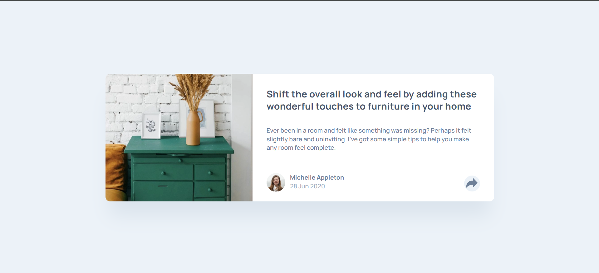
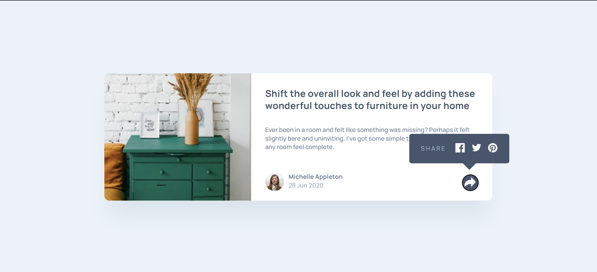

# Frontend Mentor - Article preview

## Table of contents

- [Overview](#overview)
  - [Screenshot](#screenshot)
  - [Links](#links)
- [My process](#my-process)
  - [Built with](#built-with)

## Overview

This is an article preview component designed using html and css , added javascript for a interactive experience

### Screenshot

### Links

- Live Site URL: [View live site](https://maryam-hytham.github.io/article-preview-component/)

## My process

### Built with

- Semantic HTML5 markup
- CSS custom properties
- Flexbox
- Mobile-first workflow
- JavaScript DOM manupilation
